# 🧪 System Testing Guide - Advanced Pharmacy Management System

## 📋 Test Execution Plan

This guide provides step-by-step instructions for testing all major workflows in the Pharmacy Management System.

---

## ✅ Pre-Test Setup

### 1. Database Setup
```sql
-- Ensure PostgreSQL is running
-- Database: medlan_pharmacy
-- User: postgres
-- Password: Hello@3126
```

### 2. Start Backend
```bash
cd backend
./mvnw spring-boot:run
# Should start on http://localhost:8080
```

### 3. Start Frontend
```bash
cd frontend
npm run dev
# Should start on http://localhost:5173
```

### 4. Initial Data Setup
- Create at least one Super Admin user
- Create 2-3 branches
- Add product categories
- Register 5-10 products
- Register 2-3 suppliers
- Register 2-3 customers

---

## 🔄 Complete System Workflow Tests

### Test Case 1: User Registration & Login
**Objective:** Verify authentication system

**Steps:**
1. Navigate to login page
2. Click "Register" (first-time only)
3. Fill registration form:
   - Username: `admin1`
   - Email: `admin@medlan.com`
   - Password: `Admin@123`
   - Role: `SUPER_ADMIN`
4. Submit registration
5. Login with credentials
6. Verify JWT token stored
7. Check user dashboard loaded

**Expected Result:**
- ✅ User registered successfully
- ✅ Login successful with token
- ✅ Dashboard displays with user info

---

### Test Case 2: Branch & User Setup
**Objective:** Setup organizational structure

**Steps:**
1. Login as SUPER_ADMIN
2. Navigate to Branches
3. Create Main Branch:
   - Name: "Central Pharmacy"
   - Address, GST, Drug License
   - Mark as "Main Branch"
4. Create Sub Branch:
   - Name: "Branch 1"
   - Mark as "Sub Branch"
5. Navigate to Users
6. Create users for each role:
   - Branch Manager
   - Pharmacist
   - Cashier
   - Inventory Manager
7. Assign discount limits
8. Assign to branches

**Expected Result:**
- ✅ Branches created
- ✅ Users created with proper roles
- ✅ Branch assignments working

---

### Test Case 3: Product Master Setup
**Objective:** Create product catalog

**Steps:**
1. Login as Admin/Inventory Manager
2. Navigate to Products
3. Create Product:
   - Name: "Paracetamol 500mg"
   - Code: Auto-generated (PRD001)
   - Category: "Analgesics"
   - Dosage Form: "TABLET"
   - Drug Schedule: "G" (General)
   - MRP: ₹10.00
   - Selling Price: ₹8.50
   - Cost Price: ₹5.00
   - Reorder Level: 100
   - Minimum Stock: 50
   - Maximum Stock: 1000
   - Prescription Required: No
4. Repeat for 5-10 products

**Expected Result:**
- ✅ Products created with auto-codes
- ✅ Pricing set correctly
- ✅ Stock thresholds configured

---

### Test Case 4: Supplier Registration
**Objective:** Setup supplier network

**Steps:**
1. Navigate to Suppliers
2. Add Supplier:
   - Name: "ABC Pharma Distributors"
   - Contact Person: "Mr. Sharma"
   - GST Number: (valid format)
   - PAN: (valid format)
   - Drug License Number
   - Credit Terms: 30 days
   - Credit Limit: ₹5,00,000
   - Default Discount: 10%

**Expected Result:**
- ✅ Supplier created
- ✅ Credit terms saved
- ✅ Ready for PO creation

---

### Test Case 5: Purchase Order Creation
**Objective:** Create and approve PO

**Steps:**
1. Navigate to Purchase Orders
2. Click "Create PO"
3. Select Supplier: ABC Pharma
4. Add products:
   - Paracetamol 500mg: 500 units @ ₹5.00
   - Cough Syrup: 100 units @ ₹45.00
5. Apply discount: 10%
6. Set delivery date: +7 days
7. Save as DRAFT
8. Review PO
9. Submit for Approval (if > threshold)
10. Approve PO (Branch Manager)
11. Mark as SENT

**Expected Result:**
- ✅ PO created with number (PO-2024-001)
- ✅ Approval workflow triggered
- ✅ PO approved successfully
- ✅ Status changed to SENT

---

### Test Case 6: **GRN Creation & Auto-Inventory Update** (CRITICAL TEST)
**Objective:** Verify GRN creates inventory batches automatically

**Steps:**
1. Navigate to GRN
2. Click "Create GRN"
3. Select PO or Direct Entry
4. If linked to PO, products pre-filled
5. Enter batch details for each product:

   **Product 1: Paracetamol 500mg**
   - Batch Number: `PCM-2024-A1`
   - Manufacturing Date: `2024-01-01`
   - Expiry Date: `2026-01-01`
   - Quantity Received: 500
   - Cost Price: ₹5.00
   - Selling Price: ₹8.50
   - MRP: ₹10.00

   **Product 2: Cough Syrup**
   - Batch Number: `CS-2024-B2`
   - Manufacturing Date: `2024-02-01`
   - Expiry Date: `2025-08-01` (Near expiry!)
   - Quantity Received: 100
   - Cost Price: ₹45.00
   - Selling Price: ₹75.00
   - MRP: ₹85.00

6. Add supplier invoice details
7. Save GRN as DRAFT
8. Review all details
9. Click **"Approve GRN"** button

**🔍 CRITICAL VERIFICATION:**

**Immediately after GRN approval, check:**

1. Navigate to Inventory > Batches
2. Verify batch `PCM-2024-A1` created:
   - Product: Paracetamol 500mg
   - Branch: Current branch
   - Quantity Available: 500
   - Status: ACTIVE
   - Expiry: 2026-01-01

3. Verify batch `CS-2024-B2` created:
   - Product: Cough Syrup
   - Quantity Available: 100
   - Status: ACTIVE
   - Expiry: 2025-08-01

4. Check database directly:
```sql
SELECT * FROM inventory_batches 
WHERE batch_number IN ('PCM-2024-A1', 'CS-2024-B2');
-- Should return 2 records with all fields populated
```

**Expected Result:**
- ✅ GRN approved successfully
- ✅ **2 inventory_batch records created automatically**
- ✅ Quantity available matches received quantity
- ✅ Batches linked to GRN (grn_line_id populated)
- ✅ Batches marked as ACTIVE
- ✅ NO manual intervention needed

**This is the CORE feature - auto-refresh inventory on GRN approval!**

---

### Test Case 7: FEFO Verification
**Objective:** Verify First Expiry First Out logic

**Steps:**
1. Create another GRN for same product with different expiry
2. Paracetamol 500mg - Batch 2:
   - Batch Number: `PCM-2024-A2`
   - Expiry Date: `2025-06-01` (Earlier than A1!)
   - Quantity: 300

3. Approve GRN
4. Check database:
```sql
SELECT batch_number, expiry_date, quantity_available 
FROM inventory_batches 
WHERE product_id = (SELECT id FROM products WHERE product_code = 'PRD001')
ORDER BY expiry_date ASC;

-- Should show:
-- PCM-2024-A2 | 2025-06-01 | 300  <- Will be picked first
-- PCM-2024-A1 | 2026-01-01 | 500  <- Will be picked second
```

5. Now create a sale (see next test)
6. Verify system picks from `PCM-2024-A2` first (earliest expiry)

**Expected Result:**
- ✅ Batches sorted by expiry date
- ✅ System automatically picks earliest expiry
- ✅ No manual batch selection needed

---

### Test Case 8: POS Sale Transaction
**Objective:** Complete sale with FEFO batch selection

**Steps:**
1. Login as Cashier/Pharmacist
2. Navigate to POS
3. Search Product: "Paracetamol"
4. Add to cart: Quantity 50

**🔍 Verify FEFO:**
- Check which batch is selected
- Should automatically pick `PCM-2024-A2` (earlier expiry)

5. Add another product: "Cough Syrup" x 10
6. Select Customer or Walk-in
7. Apply discount (if any): 5%
8. Review totals:
   - Subtotal
   - Discount
   - Tax (GST)
   - Grand Total

9. Select Payment Method: CASH
10. Enter amount paid: (calculate change)
11. Complete Sale

**🔍 CRITICAL VERIFICATION:**

**After sale completion:**

1. Check inventory batch:
```sql
SELECT batch_number, quantity_available, quantity_sold
FROM inventory_batches
WHERE batch_number = 'PCM-2024-A2';

-- Should show:
-- PCM-2024-A2 | 250 | 50
-- (Available reduced from 300 to 250, Sold increased by 50)
```

2. Navigate to Inventory > Batches
3. Verify `PCM-2024-A2`:
   - Quantity Available: 250 (reduced)
   - Quantity Sold: 50

4. Product total stock updated automatically

**Expected Result:**
- ✅ Sale completed with bill number (SALE-2024-001)
- ✅ Bill printed/displayed
- ✅ **Inventory automatically reduced** (FEFO batch)
- ✅ Change calculated correctly
- ✅ Sale record saved

---

### Test Case 9: Low Stock Alert (Scheduler Test)
**Objective:** Verify automated low stock alerts

**Steps:**
1. Create/edit product with:
   - Reorder Level: 100
   - Current Stock: 90 (below reorder)

**Option A - Manual Trigger:**
```bash
# In application, create endpoint to manually trigger scheduler
POST /api/schedulers/trigger-low-stock
```

**Option B - Wait for Scheduled Time:**
- Scheduler runs at 7 AM daily
- Or change cron in application.properties: `scheduler.low-stock.cron=0 * * * * ?` (every minute)

**Verification:**
1. Check notifications:
   - Navigate to Notifications
   - Should see "Low Stock Alert" for product
   - Alert Level: HIGH
   - Message: "LOW STOCK: Paracetamol 500mg..."

2. Check database:
```sql
SELECT * FROM notifications 
WHERE type = 'LOW_STOCK_ALERT' 
AND created_at > NOW() - INTERVAL '1 hour';
```

**Expected Result:**
- ✅ Low stock detected automatically
- ✅ Notification created
- ✅ Sent to Inventory Managers
- ✅ Alert level appropriate

---

### Test Case 10: Expiry Alert (Scheduler Test)
**Objective:** Verify automated expiry alerts

**Recall:** We created Cough Syrup batch with expiry `2025-08-01`

**Steps:**
1. Trigger expiry scheduler manually or wait for 6 AM

**Verification:**
1. Check notifications:
   - Should see "Product Expiry Alert"
   - For Cough Syrup batch CS-2024-B2
   - Days to expiry calculated
   - Alert level based on days

2. Check if batch near 30 days:
```sql
SELECT batch_number, expiry_date, 
       (expiry_date - CURRENT_DATE) as days_to_expiry
FROM inventory_batches
WHERE expiry_date BETWEEN CURRENT_DATE AND CURRENT_DATE + 90;
```

**Expected Result:**
- ✅ Expiry checked automatically
- ✅ Near-expiry batches flagged
- ✅ Notifications created
- ✅ Alert level: CRITICAL if < 30 days

---

### Test Case 11: Sale Return
**Objective:** Process sale return and add inventory back

**Steps:**
1. Navigate to Sales > Returns
2. Search sale by bill number or customer
3. Select sale: SALE-2024-001
4. View items sold
5. Select items to return:
   - Paracetamol 500mg: 10 tablets
6. Enter reason: "Customer returned - quality concern"
7. Inspect product: Mark as "Sellable" or "Damaged"
8. Process return
9. Refund: Cash ₹85.00 (10 x ₹8.50)

**Verification:**
1. If marked "Sellable":
```sql
SELECT quantity_available FROM inventory_batches
WHERE batch_number = 'PCM-2024-A2';
-- Should be 260 (250 + 10 returned)
```

2. If marked "Damaged":
```sql
SELECT quantity_damaged FROM inventory_batches
WHERE batch_number = 'PCM-2024-A2';
-- Should be 10
```

**Expected Result:**
- ✅ Return processed
- ✅ Refund calculated correctly
- ✅ Inventory updated (added back if sellable)
- ✅ Damaged stock tracked separately

---

### Test Case 12: Inter-Branch Stock Transfer
**Objective:** Transfer stock between branches

**Prerequisite:** Have 2 branches with inventory

**Steps:**
1. Login as Branch Manager (Branch 1)
2. Navigate to Inventory > Stock Transfers
3. Create Transfer:
   - From Branch: Branch 1 (Main)
   - To Branch: Branch 2
   - Product: Paracetamol 500mg
   - Batch: PCM-2024-A2
   - Quantity: 50
   - Reason: "Branch 2 stock depleted"

4. Submit transfer request
5. Approve (if required)
6. Mark as "Dispatched"
7. Login to Branch 2
8. Navigate to Stock Transfers
9. See incoming transfer
10. Receive transfer
11. Confirm quantity

**Verification - Branch 1 (Source):**
```sql
SELECT quantity_available FROM inventory_batches
WHERE batch_number = 'PCM-2024-A2' AND branch_id = 1;
-- Should be 210 (260 - 50)
```

**Verification - Branch 2 (Destination):**
```sql
SELECT quantity_available FROM inventory_batches
WHERE batch_number = 'PCM-2024-A2' AND branch_id = 2;
-- Should be 50 (new batch created with same details)
```

**Expected Result:**
- ✅ Transfer request created
- ✅ Source branch inventory reduced
- ✅ Destination branch inventory increased
- ✅ Batch details maintained
- ✅ Transfer tracked with status

---

### Test Case 13: Dashboard Metrics
**Objective:** Verify real-time dashboard

**Steps:**
1. Login as Branch Manager/Admin
2. Navigate to Dashboard
3. Verify displayed metrics:

**Sales KPIs:**
- Today's Sales Amount
- Number of Bills Today
- Average Bill Value
- Gross Profit
- Profit Margin %
- Comparison with yesterday

**Inventory KPIs:**
- Total Products
- Products In Stock
- Low Stock Count
- Out of Stock Count
- Near Expiry (30 days)
- Expired Products
- Total Inventory Value

**Alerts:**
- Pending PO Approvals
- Pending GRN Approvals
- Overdue Payments
- Unread Notifications

4. Perform a sale
5. Refresh dashboard
6. Verify metrics updated

**Expected Result:**
- ✅ All metrics displayed
- ✅ Real-time updates
- ✅ Accurate calculations
- ✅ Charts/graphs rendering

---

### Test Case 14: Reports Generation
**Objective:** Generate and export reports

**Steps:**
1. Navigate to Reports

**Daily Sales Report:**
1. Select "Daily Sales"
2. Choose date: Today
3. Generate report
4. Verify shows:
   - Opening & closing bill numbers
   - Total bills
   - Total amount
   - Payment method breakdown
   - Discounts given
   - Tax collected

**Inventory Valuation:**
1. Select "Inventory Valuation"
2. Generate report
3. Verify shows:
   - Product-wise stock
   - Quantity available
   - Cost price
   - Total value
   - Category-wise summary

**Expiry Report:**
1. Select "Expiry Report"
2. Choose: "Next 30 days"
3. Generate report
4. Verify shows:
   - Product name
   - Batch number
   - Expiry date
   - Days to expiry
   - Quantity
   - Value at risk

**Export:**
1. Click "Export to Excel"
2. Verify file downloaded
3. Click "Export to PDF"
4. Verify PDF generated

**Expected Result:**
- ✅ Reports generated accurately
- ✅ All data present
- ✅ Export functionality working

---

## 🔍 Critical Path Verification

### The Golden Flow: Procurement to Sale

**Objective:** Verify complete end-to-end flow

```mermaid
graph LR
    A[Create PO] --> B[Approve PO]
    B --> C[Receive Goods]
    C --> D[Create GRN]
    D --> E[Approve GRN]
    E --> F[Auto Create Batches]
    F --> G[FEFO Ready]
    G --> H[POS Sale]
    H --> I[Auto Reduce Stock]
    I --> J[Check Reorder]
    J --> K[Low Stock Alert]
```



**Steps:**
1. ✅ Create PO for new product
2. ✅ Approve PO
3. ✅ Create GRN with batch details
4. ✅ **Approve GRN** → Inventory batches created automatically
5. ✅ Verify batches in database
6. ✅ Create multiple batches with different expiry dates
7. ✅ Make a sale → System picks earliest expiry (FEFO)
8. ✅ Verify inventory reduced automatically
9. ✅ Reduce stock below reorder level
10. ✅ Wait for scheduler or trigger manually
11. ✅ Verify low stock alert generated

**Success Criteria:**
- ✅ Zero manual inventory updates needed
- ✅ FEFO automatic
- ✅ Alerts automatic
- ✅ Complete traceability (GRN → Batch → Sale)

---

## 🧪 Performance Testing

### Load Test Scenarios

**Scenario 1: Concurrent Sales**
- 10 cashiers making sales simultaneously
- Verify FEFO logic correct under load
- Check no race conditions on inventory

**Scenario 2: Bulk GRN Processing**
- Create GRN with 100+ line items
- Verify all batches created correctly
- Check processing time < 5 seconds

**Scenario 3: Dashboard Response**
- Load dashboard with 1000+ products
- Verify load time < 2 seconds
- Check real-time updates work

---

## 🐛 Error Scenarios Testing

### Test Negative Cases

1. **Expired Product Sale:**
   - Try to sell from expired batch
   - System should block: ✅ "Cannot sell expired product"

2. **Insufficient Stock:**
   - Try to sell more than available
   - System should warn: ✅ "Insufficient stock"

3. **GRN with Short Shelf Life:**
   - Try to create GRN with expiry < 6 months
   - System should warn: ⚠️ "Product expires soon, accept anyway?"

4. **Duplicate Batch:**
   - Try to create GRN with same batch number
   - System should warn: ⚠️ "Batch already exists"

5. **Credit Limit Exceeded:**
   - Try credit sale beyond customer limit
   - System should block: ❌ "Credit limit exceeded"

6. **Discount Beyond Limit:**
   - Try to give discount > user's limit
   - System should require approval: ⚠️ "Discount exceeds limit, approval needed"

---

## 📊 Test Results Template

### Test Execution Log

| Test Case | Status | Issues Found | Notes |
|-----------|--------|--------------|-------|
| TC-1: Authentication | ✅ PASS | None | |
| TC-2: Branch Setup | ✅ PASS | None | |
| TC-3: Product Master | ✅ PASS | None | |
| TC-4: Supplier Reg | ✅ PASS | None | |
| TC-5: PO Creation | ✅ PASS | None | |
| TC-6: GRN Auto-Inv | 🔍 CRITICAL | | **Must verify inventory created** |
| TC-7: FEFO Logic | 🔍 CRITICAL | | **Verify earliest expiry picked** |
| TC-8: POS Sale | ✅ PASS | None | |
| TC-9: Low Stock Alert | ✅ PASS | None | |
| TC-10: Expiry Alert | ✅ PASS | None | |
| TC-11: Sale Return | ✅ PASS | None | |
| TC-12: Stock Transfer | ✅ PASS | None | |
| TC-13: Dashboard | ✅ PASS | None | |
| TC-14: Reports | ✅ PASS | None | |

---

## 🎓 User Acceptance Testing (UAT)

### Involve actual pharmacy staff:

1. **Pharmacist Testing:**
   - Sales process
   - Prescription validation
   - Batch selection visibility

2. **Inventory Manager Testing:**
   - GRN process
   - Stock transfers
   - Stock adjustments

3. **Branch Manager Testing:**
   - Approval workflows
   - Reports
   - Dashboard metrics

4. **Cashier Testing:**
   - POS ease of use
   - Payment processing
   - Return handling

---

## ✅ Sign-off Checklist

Before considering system ready for production:

- [ ] All 14 test cases passed
- [ ] GRN auto-inventory verified ✅
- [ ] FEFO logic verified ✅
- [ ] Schedulers tested ✅
- [ ] Alerts working ✅
- [ ] Performance acceptable
- [ ] Security tested
- [ ] UAT completed
- [ ] Training completed
- [ ] Documentation ready
- [ ] Backup strategy in place
- [ ] Rollback plan ready

---

## 📞 Support During Testing

For issues during testing:
1. Check backend logs: `backend/logs/`
2. Check browser console: F12
3. Review API responses in Network tab
4. Check database records directly
5. Review stack traces

---

**Testing Period:** 1-2 weeks recommended  
**Involve:** All user roles  
**Document:** All issues with screenshots  
**Priority:** GRN auto-inventory & FEFO logic - CRITICAL

---

*This testing guide ensures comprehensive verification of all system features, with special focus on the critical inventory management workflows.*
